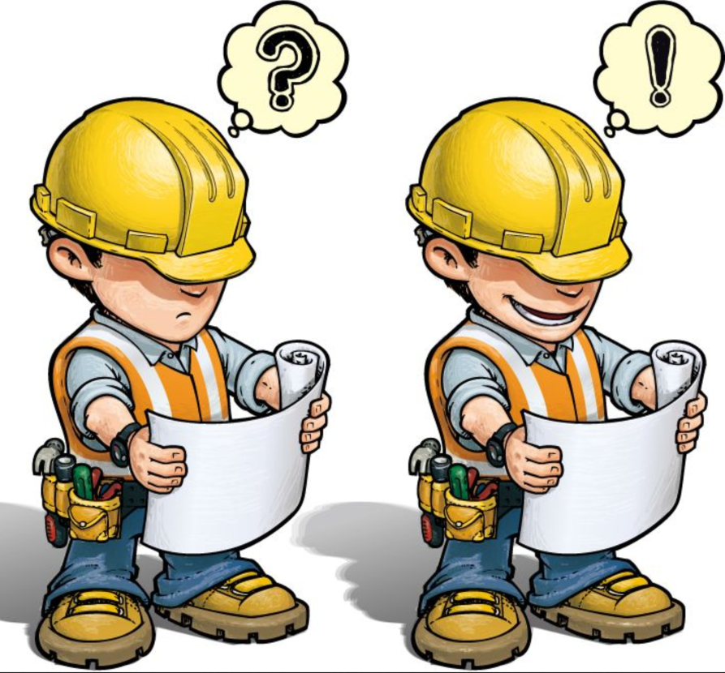
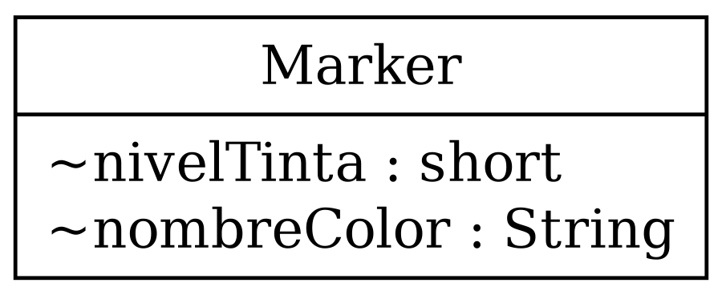

---
theme:
    override:
        code:
            theme_name: railsEnvy
        default:
            colors:
                background: "10141c"
---
<!-- column_layout: [1,3] -->
<!-- column: 0 -->
<!-- jump_to_middle -->
# **Constructors**

Mitsiu Alejandro Carreño Sarabia
<!-- column: 1 -->
<!-- jump_to_middle -->

<!-- reset_layout -->
<!-- end_slide -->

Agenda
---
├── Recap      
├── Constructor        
├── Class vs Instances      
├── Marker constructor        
├── Glossary        
└── Challenge    
<!-- end_slide -->

# Recap
---
1. We create a `custom (user-defined) data type`: 
<!-- pause -->
- - **class Marker**       
2. We bind several marker `properties (attributes/instance variables)` into our Marker object:
<!-- pause -->
- - **String nombreColor;**      
- - **short nivelTinta;**    


<!-- end_slide -->

# Recap
---
What happens on line 7?
```java +line_numbers {7}
class Marker {
    String nombreColor;
    short nivelTinta;
}
class E11IntroPoo {
    public static void main(String[] args) {
        Marker marcadorBlanco = new Marker(); 
        marcadorBlanco.nombreColor="Blanco";
        marcadorBlanco.nivelTinta=100;
    }
}
```
<!-- end_slide -->

## Constructor
---
Let's focus on the code after equals:
```java 
new Marker();
```
What does that means?
<!-- pause -->
- new
- Instance?
<!-- end_slide -->

## Constructor
---
What does
```java
(); 
```
means?
<!-- pause -->
- We are invoking a function!       
- A `special function` called `constructor`
- Did we implement any function in our marker class?
<!-- end_slide -->

## Constructor
---
- Did we implement any function in our marker class?

We didn't but `the language provides a default constructor` if we dont.         

This special function `handles the object creation logic`.
<!-- end_slide -->

## Constructor
---
A constructor is a function `without` return value keyword and has the same name as the class:
<!-- pause -->
```java +line_numbers {all}
class Marker {
    String nombreColor;
    short nivelTinta;
    Marker(){
        System.out.println("Creating a marker");
    }
}
class E12Constructor {
    public static void main(String[] args) {
        new Marker();
        Marker marcadorBlanco = new Marker();
    }
}
```
<!-- end_slide -->

### Marker constructor
---
When we create a marker we fill out the color ink, that's part of the marker creation process.
```java +line_numbers {all}
class Marker {
    String nombreColor;
    short nivelTinta;

    Marker(){
        this.nivelTinta = 100;
    }
}
```
<!-- end_slide -->

#### Glossary 
---
> constructor
A pseudo-method that creates an object. In the Java programming language, constructors are instance methods with the same name as their class. Constructors are invoked using the new keyword. 
---
> this
> A Java keyword that can be used to represent an instance of the class in which it appears. this can be used to access class variables and methods. 
<!-- end_slide -->

##### Challenge
---
How can we modify the code from **E12Constructor** to assign the color String during object creation?  

Hint: Use parameters
<!-- end_slide -->

###### References
---
https://www.oracle.com/java/technologies/glossary.html
