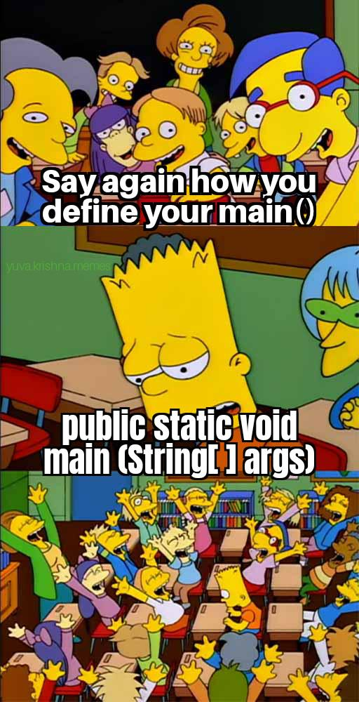
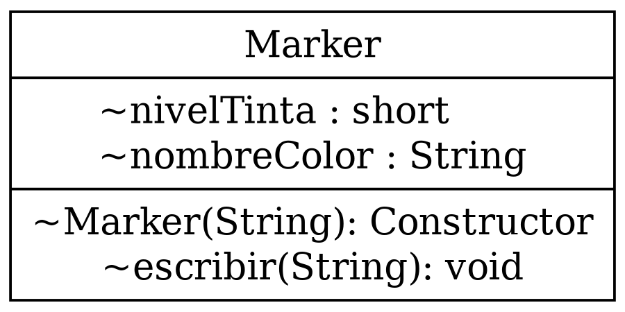
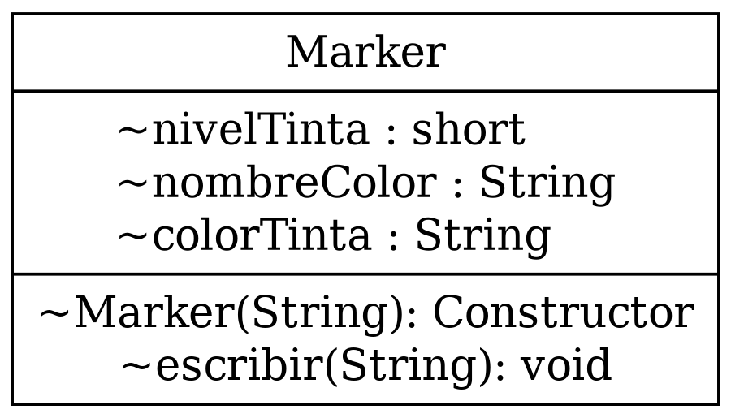

---
theme:
    override:
        code:
            theme_name: railsEnvy
        default:
            colors:
                background: "10141c"
---
<!-- column_layout: [1,3] -->
<!-- column: 0 -->
<!-- jump_to_middle -->
# **Methods**

Mitsiu Alejandro Carreño Sarabia
<!-- column: 1 -->

<!-- reset_layout -->
<!-- end_slide -->

Agenda
---
├── Recap      
├── Constructor        
├── Class vs Instances      
├── Marker constructor        
├── Glossary        
└── Challenge    
<!-- end_slide -->

# Recap
---
```java +line_numbers {all}
class Marker {
    String nombreColor;
    short nivelTinta;

    Marker(String color){
        this.nivelTinta = 100;
        this.nombreColor = color;
    }
}
class E12Constructor {
    public static void main(String[] args) {
        Marker marcadorBlanco = new Marker("Blanco");
    }
}
```
<!-- end_slide -->

## Methods
---
As we've seeen we have:
- Instance variables (Attributes)
- Constructor

Does a function inside Marker makes sence?           

If a function `performs a task` how could it be useful?

Which tasks does a marker is able to perform?
<!-- end_slide -->

### Marker methods
---

<!-- end_slide -->

### Marker methods
---
Does performing the action **"escribir(String): void"** affect any of our instance variables?

<!-- pause -->
How can we translate this relationship between nivelTinta and escribir()?

> this
> A Java keyword that can be used to represent an instance of the class in which it appears. this can be used to access class variables and methods. 

```java +line_numbers {all}
for (char letra :  <string>.toCharArray())
```
<!-- end_slide -->

#### Implementation details
---
<!-- column_layout: [1,1] -->
<!-- column: 0 -->
Finally adjust your code to this UML diagram:

<!-- pause -->
<!-- column: 1 -->
In your constructor:
| nombreColor | colorTinta |
|-------------|------------|
| Rojo        | \u001B[31m |
| Verde       | \u001B[32m |
| Azúl        | \u001B[34m |

In escribir method:
```java +line_numbers {all}
void escribir(String texto){
  Sop(this.colorTinta);
  ...
  Sopln("\u001B[0m");
```

